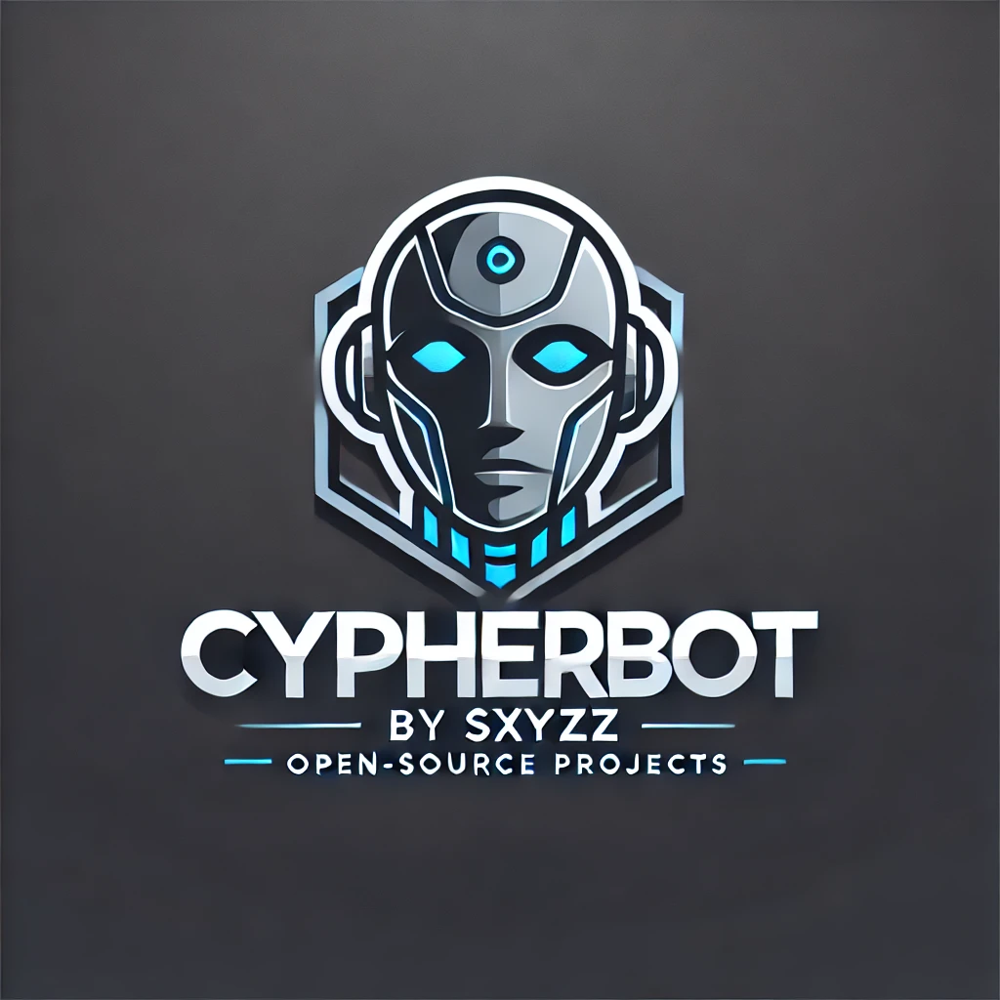

<div align="center">

# 🌟 CypherBot

### Bot WhatsApp **OPEN-SOURCE** Berbasis Baileys



[](https://github.com/sxyz-dev/CypherBot)
[](https://github.com/AxellNetwork/Baileys)
[](https://github.com/yourusername/CypherBot)
[](https://github.com/yourusername/CypherBot)

</div>

## 🚀 Tentang CypherBot

CypherBot adalah project bot WhatsApp yang dibangun menggunakan library [Axell Baileys](https://github.com/AxellNetwork/Baileys). Saat ini dalam tahap beta testing dengan pengembangan aktif!

## ⚡ Update Terbaru

<div align="center">

### 🛠️ Tools & Utilitas


```js
📊 tools-polling    // Buat polling interaktif di grup
🔗 tools-tourl      // Konversi media ke URL
🌐 tools-translate  // Terjemahan multi bahasa
```

### 👑 Fitur Owner


```js
⚙️ own-eval        // Evaluasi kode JavaScript
```

### 📥 Downloader


```js
🎵 dl-play         // Putar audio/video dari YouTube
🎧 dl-ytmp3        // Download audio YouTube
🎬 dl-ytmp4        // Download video YouTube
📱 dl-tiktok       // Download video TikTok
```

</div>

## 🔒 Status Project

```haskell
Status     : Beta Testing
Versi      : 0.0.1
Total Fitur: 56+
Akses      : Tertutup (Sampai v2.0.0)
```

## ⚠️ Pemberitahuan Penting

<div align="center">

### `🔐 KONTRIBUSI DITUTUP`

</div>

> Project ini **DITUTUP** untuk kontribusi eksternal hingga versi 2.0.0 dirilis.
> Tidak menerima push atau pull request selama fase pengembangan ini.

## 📱 Teknologi

<div align="center">

• `Baileys`
• `JavaScript`

</div>

## 🐛 Laporan Bug

Menemukan bug? Segera hubungi developer:

<div align="center">

[](mailto:sxyzz.dev@gmail.com)

</div>

---

<div align="center">

### 💫 Dikembangkan dengan ❤️ oleh Tim CypherBot

<br>

[](https://github.com/sxyz-dev/CypherBot)
[](https://github.com/sxyz-dev/CypherBot)

---
### 🗞 Support Community

[](https://whatsapp.com/channel/0029Vb3lj2l8V0tlKG7av62W)

[](https://chat.whatsapp.com/LrXs5UBnBVdAHhSXDcDwe0)
---
</div>